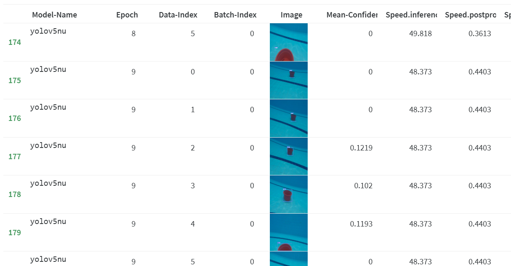
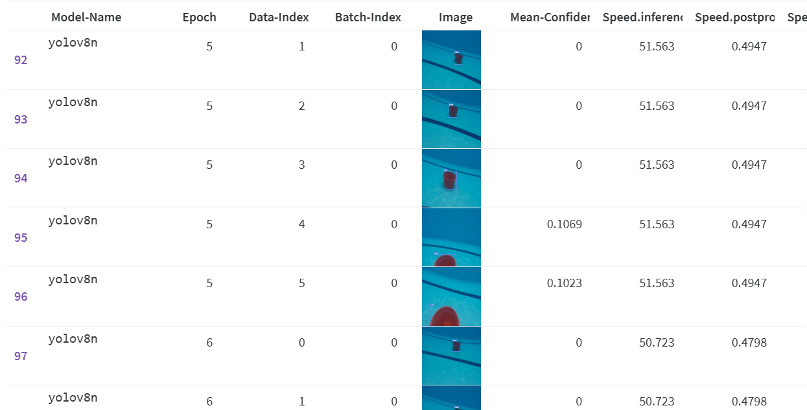
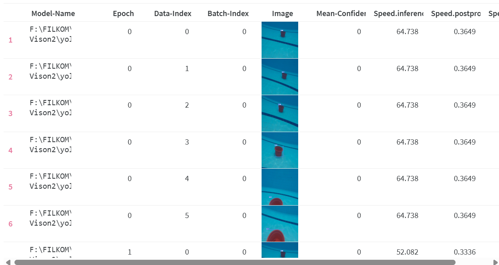

# Submission 3️⃣ Samuel YOLO Track ur Models

## 📙Deskripsi Project 

=== Gondrong Jenius Confuse to Find The Best Model ===

Gondrong Jenius mengalami kesulitan saat tuning model YOLO untuk mendapatkan performa terbaik. Kami membantu Gondrong dengan melatih tiga varian model YOLO yaitu 
- YOLOv5n,
-  YOLOv8n, 
-  YOLOv11n  

lalu membandingkan hasilnya menggunakan Weights & Biases (W&B) dan visualisasi hasil prediksi dalam bentuk `.gif`.

## 🔹Tools
- Ultralytics `yolo` CLI
- Python 3.10.9
- Weights & Biases (W&B)
- OpenVINO Export
- Tensor (Gabisa, gatau kenapa padahal ada GPU Nvidia)

## 🎯 HASIL & PERBANDINGAN 

| Model    | Waktu Inference (ms) | 
|----------|----------------------|
| YOLOv5n  |  48  |   
| YOLOv8n  | 51 |
| YOLOv11n |  64|

YOLOv5n

YOLOv8n

YOLOv11n

## 🔗 Author
Samuel Silitonga - Vision

Link W&B :
https://wandb.ai/sams-p-h-sltg-brawijaya-university/projects 

