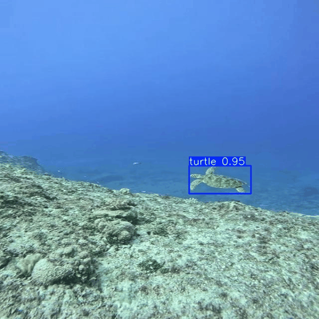
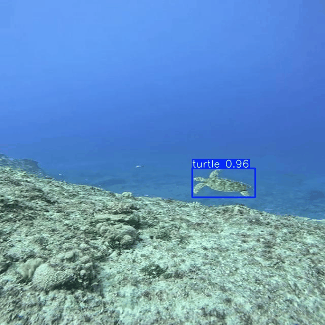

# Submission 03 YOLO Track ur Models

Tugas ini membandingkan performa dari **tiga versi YOLO**:
- **YOLOv5s**
- **YOLOv8s**

## Tautan W&B
https://wandb.ai/ezranewbie17-brawijaya-university/yolo-wandb-project?nw=nwuserezranewbie17 

##  Spesifikasi
| Perangkat         | Info                              |
|------------------|-----------------------------------|
| GPU              | NVIDIA RTX 2060 Max-Q             |
| CPU              | Intel Core i5-10300H              |
| RAM              | 16 GB                             |
| Ekspor           |  OpenVINO dan   TensorRT (GPU) |
| Data             | Turtle Detection Custom Dataset    |
| Image Size       | 640 x 640                          |
| Framework        | Ultralytics YOLOv5, YOLOv8, YOLO11 |
| Tracking Tool    | Weights & Biases (W&B)            |

---

##  Rata-rata Waktu Inference per Model

### 1. YOLOv5s

| Model       | Versi    | Waktu Inference per Gambar (ms) | Keterangan Tambahan               |
| ----------- | -------- | ------------------------------- | --------------------------------- |
| **YOLOv5s** | PyTorch  | **39.3 ms**                     | (sebelum export)                  |
|             | OpenVINO | **704.9 ms**                    | Terdapat outlier (1393ms, 1070ms) |

#### 🎞️ Hasil Prediksi
| Sebelum Export | Setelah Export |
|----------------|----------------|
|  |  |

---

### 🔍 2. YOLOv8s

| Versi             | Inference Time (ms) |
|------------------|---------------------|
| PyTorch           | ~45.3 ms            |
| OpenVINO          | ~610.3 ms           |
| TensorRT (GPU)    | ~XX ms              |

#### 🎞️ Hasil Prediksi
| Sebelum Export | Setelah Export |
|----------------|----------------|
|  |  |

---

## 🧠 Kesimpulan
| Model       | Versi    | Waktu Inference per Gambar (ms) | Keterangan Tambahan               |
| ----------- | -------- | ------------------------------- | --------------------------------- |
| **YOLOv5s** | PyTorch  | **39.3 ms**                     | (sebelum export)                  |
|             | OpenVINO | **704.9 ms**                    | Terdapat outlier (1393ms, 1070ms) |
| **YOLOv8s** | PyTorch  | **39.5 ms**                     | (sebelum export)                  |
|             | OpenVINO | **518.3 ms**                    | Terdapat outlier (896ms, 575ms)   |

- YOLOv5s dan YOLOv8s memiliki performa hampir identik saat dijalankan pada PyTorch (~39 ms).
- Setelah diekspor ke OpenVINO, waktu inferensinya meningkat drastis, terutama karena adanya outlier delay yang signifikan (YOLOv5s: 1393 ms, YOLOv8s: 896 ms).
- ini menunjukkan bahwa performa di OpenVINO tidak stabil di CPU untuk model kecil (s series), kemungkinan karena overhead model loading atau threading.
